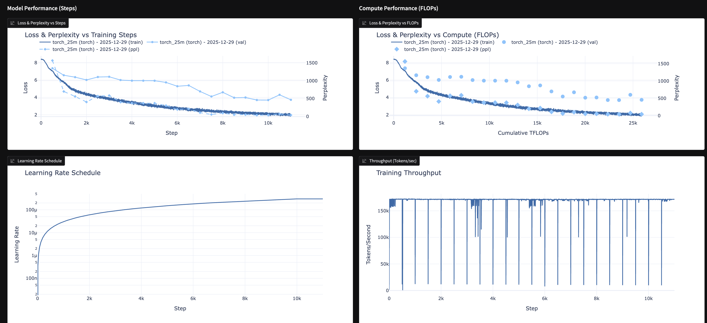
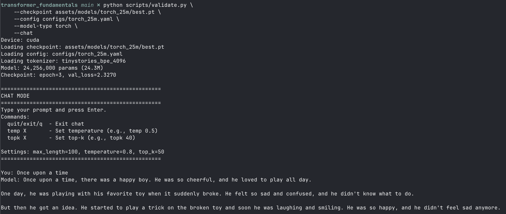

# Transformers from Scratch

Despite how prolific and simple transformers are, many implementations you'll find will include various abstractions
and optimizations which obfuscate the core architecture and learning process. 

This simple, small repo is my personal effort to understand transformer fundamentals. At it's core, this is
distilled into two simple implementations of a transformer models:

- *Custom Transfomrer*: A tensor-level implementation with explicitly defined backpropagation
- *Torch Transfomer*: A PyTorch implementation almost exactly mirrors the custom transformer to show the abstractions by PyTorch

These hand-written files should be easy to follow, with ample comments and intentional naming. The implementation is 
geared for learning, favoring simplicity over optimization, and readability over conciseness. I hope you find the
implementations easy to follow! 

The rest of the repository includes the all the necessary apartuses you'll need to take a base model and:
- Get the data necessary to train it
- Tokenize the data so it can be fed into the model
- Define a configuration for the training setup
- Train a model
- Understand core peformance metrics (e.g. loss, compute-normalized loss)
- Interact with a model you've trained

As you can guess, the core model itself ends up being pretty simple in comparison to all the supporting infra
necessary to train and evaluate the models. Thanks Claude for your help in that!

### Example

Once you've got the basic setup (dataset, tokenizer), it's pretty quick to train and compare models!

1. Kicking off Training 

Using tmux (or an alternative), you can easily train a model:
`python scripts/train.py --config configs/torch_25m.yaml --model-type torch`

2. Seeing is Believing

You can visualize the results in real-time by opening the visualizer in parallel:
`python -m visualizer`



By default, ever 500 steps and after each validation, logs will be written. Refresh and see the progress!

3. Comparing architectures

The visualizer can also be used to compare multiple model configurations to see how loss curves change. This can be seen both in terms of per-training step, but also in terms of compute FLOPs.

4. Putting it in perspective

While perplexity is more intuitive than loss, it's still not exactly clear what to expect. On 25-50M model for the TinyStories dataset, here's a more intuitive idea of what to expect. So when you think about "perplexity is how many tokens the model is chosing from" you have a more tangible idea of what that means. 

Once you've trained a model, you can experience this directly though the `--chat` interface:



```bash
# Example 25M Model (val_loss=2.33)
python scripts/validate.py \
    --checkpoint assets/models/torch_25m/best.pt \
    --config configs/torch_25m.yaml \
    --model-type torch \
    --chat

Device: cuda
Loading checkpoint: assets/models/torch_25m/best.pt
Loading config: configs/torch_25m.yaml
Loading tokenizer: tinystories_bpe_4096
Model: 24,256,000 params (24.3M)
Checkpoint: epoch=3, val_loss=2.3270

==================================================
CHAT MODE
==================================================
Type your prompt and press Enter.
Commands:
  quit/exit/q  - Exit chat
  temp X       - Set temperature (e.g., temp 0.5)
  topk X       - Set top-k (e.g., topk 40)

Settings: max_length=100, temperature=0.8, top_k=50
==================================================

You: Once upon a time
Model: Once upon a time, there was a happy boy. He was so cheerful, and he loved to play all day.

One day, he was playing with his favorite toy when it suddenly broke. He felt so sad and confused, and he didn't know what to do.

But then he got an idea. He started to play a trick on the broken toy and soon he was laughing and smiling. He was so happy, and he didn't feel sad anymore.
```


Note, the model isn't fine-tuned to provide Q&A style response, instead it's aiming to predict from "Once upon a time ..." to tell a reasonable story. Here's a general idea of what to expect

```markdown
| Loss (approx) | Perplexity | What you typically see |
|---------------|------------|------------------------|
| **5.0+** | ~150+ | Random tokens, maybe common words like "the", "a", "said" appearing frequently |
| **4.0 - 5.0** | ~55-150 | Recognizable fragments: names (Tim, Lily, Sara), simple words, but no sentence structure |
| **3.0 - 4.0** | ~20-55 | Simple sentences emerge. "The boy was happy." Subject-verb-object works. Stories don't connect. |
| **2.0 - 3.0** | ~7-20 | Coherent short stories. Characters do things, basic cause/effect. Repetitive patterns, abrupt endings. |
| **1.5 - 2.0** | ~4.5-7 | Solid TinyStories quality. Beginning/middle/end structure. Morals appear. Characters have consistent traits within a story. |
| **1.2 - 1.5** | ~3.3-4.5 | Approaching ceiling for this scale. Clean grammar, age-appropriate vocabulary, stories feel complete. Occasional creativity. |
| **< 1.2** | < 3.3 | Likely overfitting or you've got a bigger model than you think. Diminishing returns. |
```

With that, happy training! 


### Quickstart

```bash
# Clone and install
git clone <repo-url>
cd transformer_fundamentals
pip install -e .

# Verify installation
python scripts/verify_install.py

# Quick training test
python scripts/train.py --config configs/test_torch.yaml --model-type torch

# Launch visualizer to compare runs
python -m visualizer
```

#### Quick Notes on Hardware and Configuration

I've developed the example configs in this repo for Nvidia GPU with 16GB+ VRAM. If you have less 
VRAM, it should just reduce batch_size and increase gradient accumulation steps to compensate. 

In theory, it shouldn't be hard to convert this to a Mac M-chip, but I've found if the goal is 
learning, it's worth the investment of a nVidia GPU - even if just a cheap/basic one (RTX 3060's have 12GB VRAM and are commonly under $200).

### Repository Structure
<details>
<summary>Directory layout and naming conventions.</summary>

```
transformer_fundamentals/
├── models/                     # Model implementations
│   ├── custom_transformer.py   # Tensor-level transformer with manual backprop
│   ├── torch_transformer.py    # PyTorch autograd transformer
│   ├── base.py                 # Shared base classes and utilities
│   ├── config.py               # Model configuration dataclass
│   └── wrapper.py              # Unified model interface
│
├── training/                   # Training infrastructure
│   ├── checkpoint_manager.py   # Save/load checkpoints with rotation
│   ├── evaluator.py            # Validation loss and perplexity computation
│   └── logger.py               # JSON-structured training logging
│
├── tools/                      # Data preparation utilities
│   ├── dataset_registry.py     # Dataset discovery and loading
│   ├── download_dataset.py     # HuggingFace dataset downloader
│   └── tokenization.py         # BPE tokenizer training and analysis
│
├── visualizer/                 # Post-hoc training analysis (Gradio web UI)
│   ├── app.py                  # Main application interface
│   ├── plots.py                # Plotly chart generation
│   ├── data.py                 # Log file discovery and loading
│   ├── compare.py              # Summary statistics and config comparison
│   └── compute.py              # FLOPs estimation and metrics
│
├── scripts/                    # Command-line entry points
│   ├── train.py                # Unified training script (both model types)
│   └── validate.py             # Evaluation and interactive generation
│
├── configs/                    # YAML experiment configurations
│   └── {experiment_name}.yaml  # Training configurations
│
└── assets/                     # Generated outputs (gitignored)
    ├── logs/                   # JSON training logs
    ├── models/                 # Saved checkpoints
    └── datasets/               # Downloaded data
```

#### Naming Conventions

**Config Files** (`configs/`):
- Pattern: `{experiment_name}.yaml`
- The `experiment_name` field inside the YAML should match the filename

**Log Files** (`assets/logs/`):
- Pattern: `{experiment_name}_{YYYYMMDD}_{HHMMSS}.json`
- Timestamp is automatically appended when training starts

**Checkpoints** (`assets/models/`):
- Directory: `assets/models/{experiment_name}/`
- Files: `best.pt` (best validation), `latest.pt` (most recent), `checkpoint_epoch{N}_step{S}.pt`

</details>

### Tools
<details>
<summary>Tools for dataset management and tokenization.</summary>


#### Dataset Download

Download datasets from HuggingFace Hub:

```bash
python -m tools.download_dataset roneneldan/TinyStories
python -m tools.download_dataset HuggingFaceFW/fineweb --config sample-10BT
```


#### Tokenization

Unified tokenization toolkit with three subcommands:

```bash
# Analyze token distribution (helps choose vocab size)
python -m tools.tokenization analyze tinystories --subset 10000

# Train a custom BPE tokenizer from registry dataset
python -m tools.tokenization train registry tinystories 4096

# Train from JSONL file(s)
python -m tools.tokenization train file corpus.jsonl 8192

# Pre-tokenize dataset for faster training
python -m tools.tokenization pretokenize tinystories path/to/tokenizer --max-length 256
```

Python API:

```python
from tools.tokenization import (
    analyze_dataset,           # Get vocab recommendations
    train_tokenizer,           # Train from registry dataset
    train_tokenizer_from_files,# Train from JSONL
    pretokenize_dataset,       # Pre-tokenize for training
    load_pretokenized,         # Load pre-tokenized data
)

# Analyze and get recommendations
report, recommendations = analyze_dataset('tinystories', subset_size=10000)
print(report.summary())

# Train a small tokenizer
tokenizer_path = train_tokenizer('tinystories', vocab_size=4096)

# Pre-tokenize for efficient training
output = pretokenize_dataset('tinystories', tokenizer_path, max_length=256)
```
</details>

### Training
<details>
<summary>Details of the training scripts and process.</summary>

Unified training script supporting both model types:

```bash
# Train TorchTransformer (PyTorch autograd)
python scripts/train.py --config configs/torch_tinystories.yaml --model-type torch

# Train CustomTransformer (manual backprop)
python scripts/train.py --config configs/custom_tinystories.yaml --model-type custom

# Resume training from checkpoint
python scripts/train.py --config configs/torch_tinystories.yaml --model-type torch --resume

# Resume from specific checkpoint
python scripts/train.py --config configs/torch_tinystories.yaml --model-type torch --resume assets/models/experiment/best.pt
```

Training features:
- Learning rate scheduling (warmup + cosine/linear decay)
- Checkpoint management with best model tracking
- JSON logging for visualization
- Dynamic batch padding for efficiency
- bfloat16 mixed precision training

#### Configuration

Training is configured via YAML files in `configs/`:

```yaml
experiment_name: tinystories_torch

data:
  dataset: tinystories
  tokenizer: gpt2  # or path to custom tokenizer
  max_length: 256
  subset_size: 100000  # optional

model:
  d_model: 256
  n_heads: 4
  n_blocks: 6
  d_ffn: 1024
  max_seq_len: 256
  dtype: bfloat16

training:
  batch_size: 32
  num_epochs: 10
  learning_rate: 3e-4
  min_learning_rate: 3e-5
  lr_decay: cosine
  warmup_ratio: 0.1
  weight_decay: 0.01
  max_grad_norm: 1.0
  eval_every: 500
```

#### Training Utilities (Python API)

```python
from training import (
    CheckpointManager,  # Save/load checkpoints with rotation
    Evaluator,          # Validation loss and perplexity
    TrainingLogger,     # JSON-compatible structured logging
)

# Checkpoint management
checkpoint_manager = CheckpointManager(
    checkpoint_dir='assets/models/my_experiment',
    model=model,
    experiment_name='my_experiment',
)
checkpoint_manager.save(epoch=1, global_step=1000, ...)
resume_state = checkpoint_manager.load()

# Evaluation
evaluator = Evaluator(model, device='cuda')
result = evaluator.evaluate(val_loader)
print(f"Val Loss: {result.loss:.4f}, Perplexity: {result.perplexity:.2f}")

# Logging
logger = TrainingLogger(
    log_dir='assets/logs',
    experiment_name='my_experiment',
    model_type='TorchTransformer',
    model_config={...},
    train_config={...},
)
logger.log_step(step=100, epoch=0, loss=2.5, learning_rate=1e-4)
logger.log_validation(step=100, epoch=0, loss=2.3, perplexity=10.0)
logger.finish()
```
</details>

### Validation & Evaluation
<details>
<summary>Provides model evaluation and interactive text generation. </summary>

```bash
# Evaluate on validation set (loss, perplexity)
python scripts/validate.py \
    --checkpoint assets/models/test_torch/best.pt \
    --config configs/test_torch.yaml \
    --eval

# Single prompt generation
python scripts/validate.py \
    --checkpoint assets/models/test_torch/best.pt \
    --config configs/test_torch.yaml \
    --prompt "Once upon a time"

# Interactive chat mode
python scripts/validate.py \
    --checkpoint assets/models/test_torch/best.pt \
    --config configs/test_torch.yaml \
    --chat

# CustomTransformer evaluation
python scripts/validate.py \
    --checkpoint assets/models/test_custom/best.pt \
    --config configs/test_custom.yaml \
    --model-type custom \
    --eval
```

#### Generation Options

| Flag | Default | Description |
|------|---------|-------------|
| `--max-length` | 100 | Maximum tokens to generate |
| `--temperature` | 0.8 | Sampling temperature (higher = more random) |
| `--top-k` | 50 | Top-k sampling (0 = disabled) |
| `--max-batches` | all | Limit eval batches for quick testing |

#### Chat Mode Commands

In interactive chat mode:
- Type prompts and press Enter to generate
- `temp 0.5` - Adjust temperature
- `topk 40` - Adjust top-k sampling
- `quit` / `exit` / `q` - Exit chat

</details>

### Visualizer
<details>
<summary>
Web-based training comparison tool for analyzing and comparing training runs.
</summary>

```bash
# Launch the visualizer
python -m visualizer

# With public sharing link
python -m visualizer --share

# Custom port
python -m visualizer --port 8080
```

#### Features

- **Loss Curves**: Overlay training and validation loss for up to 4 runs
- **Validation Metrics**: Dual y-axis plot showing loss and perplexity
- **FLOPs-Normalized**: Loss vs cumulative compute for fair model size comparison
- **Learning Rate**: Visualize LR schedules across runs
- **Throughput**: Compare tokens/second performance
- **Config Comparison**: Side-by-side model and training configuration tables
- **Summary Table**: Quick comparison of key metrics (params, best loss, TFLOPs)

Note: FLOPs use the Chinchilla approximation (6 * N * D) where N = num model params, D = num tokens processed.

#### Python API

```python
from visualizer import (
    create_app,              # Create Gradio app
    launch,                  # Launch the visualizer
    create_loss_curves,      # Generate loss plot
    create_flops_normalized_loss,  # Compute-normalized plot
    estimate_model_params,   # Estimate params from config
)
from training import load_training_log

# Load and visualize a training run
run = load_training_log('assets/logs/my_experiment.json')
fig = create_loss_curves({'my_run': run})
fig.show()
```
</details>


